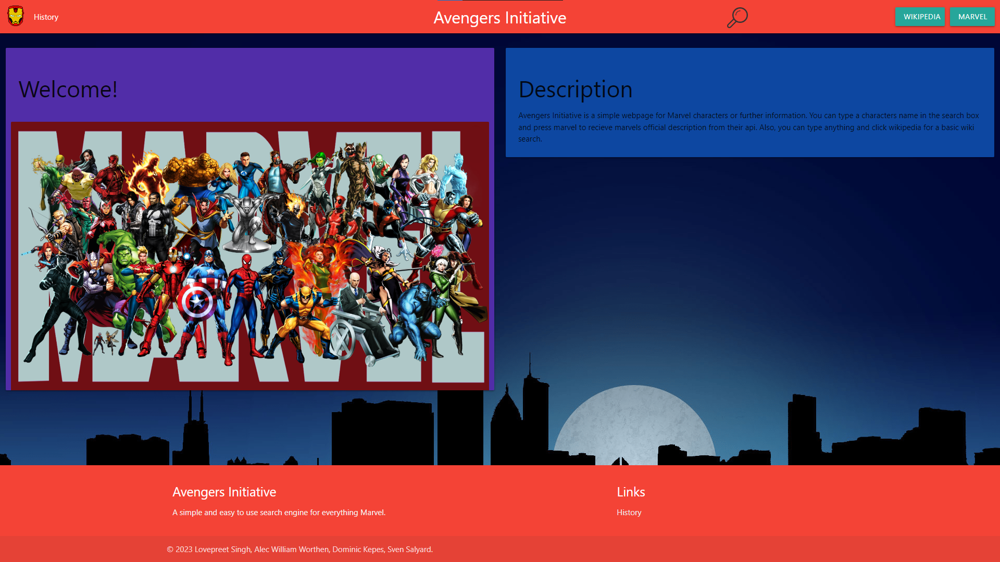

# ProjectMarvel
## About

A search engine for Marvel fans.

## User Story

AS A Marvel fan. 

I WANT to learn more about the characters. 

SO THAT I understand the comics/films better.

## Installation

N/A

## Useage

You can go to https://svensalyard.github.io/AvengersInitiative/index.html to access the website.
Typing a search in the top right box and clicking Wikipedia or Marvel buttons will pull information from
the respective API. It will propagate the page with the heroes name, image, and description. You have to be careful to type it with correct spacing/punctuation as the apis are very particular.
The wikipedia API also has some things named inccorectly, so you may get wrong results. Not all wikipedia searches will pull an image.

You will notice when going ot the history tab that it presents a list of your past searches, and if you check local stoarge, they are saved to an array.

List of working searches (so far):

- Thor
- Hulk
- iron man
- captain america

## CSS

We are using Materialize for our CSS framework.

Link: https://materializecss.com/

## APIS

We used the Marvel and Wikipedia APIS.

Marvel: https://developer.marvel.com/ 

Wikipedia: https://www.mediawiki.org/wiki/API:Main_page

## Labor

Alec and Sven: HTML and CSS: UI and Responsiveness

Lovepreet and Dominic: Javascript: Backend

Lovepreet: Marvel API

Dominic: Wikipedia APi

Alec: Slideshow

Sven: History tab